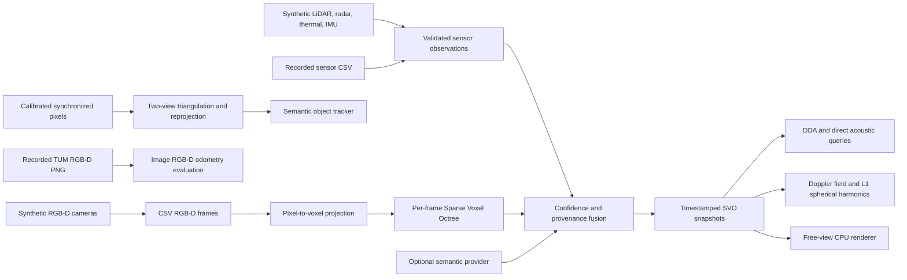

# Voxel4D

> A C++17 research proof of concept for temporal multiview and multisensor fusion in Sparse Voxel Octrees (SVOs), deterministic geometry and odometry, reference free-view rendering, direct acoustic visibility, and low-frequency spherical-harmonic lighting.

**Voxel4D is an early research prototype, not a production-ready reconstruction engine.** It provides a small, reproducible CPU baseline for the lower-level pieces of a future 4D spatial-capture pipeline. The current implementation combines deterministic synthetic observations and bounded timestamped SVO snapshots with an optional recorded TUM RGB-D replay path. Its dependency-free RGB-D odometry uses gradient features and local patch matching, but it does not connect to physical devices or provide robust production SLAM.

| Project property | Current value |
|---|---|
| Primary language | English |
| License | MIT; see [LICENSE](LICENSE) |
| Minimum language standard | C++17 |
| Build system | CMake 3.16 or newer |
| Runtime inputs | Self-generated synthetic RGB-D CSV frames; optional recorded TUM RGB-D replay |
| Status | Research PoC / pre-1.0 |

## What the PoC demonstrates

The executable generates two virtual RGB-D camera views, fuses each selected frame into an independent bounded SVO, adds deterministic RGB-D/LiDAR/radar/thermal/IMU observation envelopes with confidence and modality provenance, retains timestamped snapshots and poses, synchronizes and triangulates a calibrated stereo pair, preserves an object identity across two observations, replays the sensor envelopes through strict CSV, exposes existing annotations through an optional semantic-provider interface, estimates a known synthetic rigid motion from point correspondences, traces DDA and direct acoustic paths, evaluates first-order spherical harmonics, samples a classical acoustic Doppler field, and renders a free virtual viewpoint to PPM.

| Component | Included on the current main branch | Important limit |
|---|---|---|
| Sparse Voxel Octree | Yes | The PoC allocates sibling nodes when refining an occupied path; it is not a compact production SVO. |
| Pixel-to-voxel fusion | Yes | Synthetic RGB-D is fused in the demonstration; recorded TUM RGB-D is decoded for odometry evaluation, not yet dense multiview reconstruction. |
| Timestamped SVO and pose histories | Yes | CPU-resident, discrete, strictly ordered, bounded by count; no interpolation or clock synchronization. |
| Calibrated multiview geometry | Yes | Two-view pinhole synchronization, triangulation, and reprojection only; no feature matching, bundle adjustment, or calibration estimation. |
| Synthetic RGB-D, LiDAR, radar, thermal, and IMU envelopes | Yes | They are generated adapters with strict recorded-CSV replay, not device drivers or real sensor capture. |
| RGB-D odometry baseline | Yes, reference path | Gradient features, 3 × 3 patch matching, median-flow filtering, and rigid 3D fitting; replayed TUM fr1 evaluation is documented. No robust descriptors, RANSAC, bundle adjustment, or loop closure. |
| Object tracking and semantic layers | Yes | Greedy label-aware nearest-neighbor association and one-step velocity; no detector, segmentation model, re-identification, or occlusion handling. |
| Multisensor attribute fusion | Yes | It is deterministic confidence/provenance fusion with per-modality temporal velocity, not probabilistic mapping or SLAM. |
| DDA voxel traversal and direct acoustic blocking | Yes | CPU-only direct path; no hierarchical skipping, reflections, diffraction, or reverberation. |
| Spherical harmonics | Yes | Real first-order directional radiance only; no higher-order lighting. |
| Free-view rendering | Yes | CPU DDA first-hit reference renderer to PPM; no splatting, anti-aliasing, photorealistic shading, or production display pipeline. |
| GPU/NPU/APU execution | Architecture only | CPU serial/parallel are implemented; unavailable accelerator requests and capability status remain explicit. |
| AI integration | Interface only | Providers are explicit; the included provider only replays externally supplied labels and is not a learned model. |
| Real-time production deployment | No | Future engineering requires real devices, calibration, robust vision, accelerators, privacy controls, and field validation. |

## Quick start

### Dependencies

You need a C++17 compiler, CMake 3.16 or newer, and [GLM](https://github.com/g-truc/glm). GLM is header-only. The CMake configuration first searches for a `glm::glm` package and then falls back to a system include directory. Recorded TUM RGB-D PNG replay additionally requires the optional system `libpng` dependency; the synthetic PoC and test suite retain an explicit unavailable path when it is absent.

| Platform | Example dependency installation |
|---|---|
| Ubuntu / Debian | `sudo apt-get install build-essential cmake libglm-dev libpng-dev` |
| Fedora | `sudo dnf install gcc-c++ cmake glm-devel libpng-devel` |
| macOS with Homebrew | `brew install cmake glm libpng` |
| Windows with vcpkg | `vcpkg install glm` followed by CMake with the vcpkg toolchain file |

### Build and test

```bash
git clone https://github.com/gusinistro/voxel4d.git
cd voxel4d

cmake -S . -B build \
  -DVOXEL4D_WARNINGS_AS_ERRORS=ON \
  -DBUILD_TESTING=ON \
  -DVOXEL4D_BUILD_BENCHMARKS=ON \
  -DVOXEL4D_BUILD_TOOLS=ON
cmake --build build --parallel
ctest --test-dir build --output-on-failure
```

### Run the demonstration

```bash
./build/voxel4d_poc
```

The executable writes deterministic RGB-D CSV frames, replayed observations, and a virtual-camera `free_view.ppm` image under `build/data/` when run from the build directory. A successful run reports fusion counts, calibrated triangulation error, stable object identity, replayed labels, synthetic odometry RMS error, DDA and acoustic-path results, spherical-harmonic radiance, Doppler-field samples, and CPU rendering timings.

### Run the reproducible CPU benchmark

```bash
./build/voxel4d_render_benchmark
```

The benchmark prints CSV-compatible serial and two-worker CPU rendering timings for one fixed workload. Treat its output as a local measurement, not a universal performance claim.

### Replay the recorded TUM RGB-D reference evaluation

After obtaining the public [`freiburg1_xyz` TUM RGB-D sequence](https://cvg.cit.tum.de/data/datasets/rgbd-dataset/download) under its [CC BY 4.0 terms](https://creativecommons.org/licenses/by/4.0/), run:

```bash
./build/voxel4d_tum_odometry_eval \
  --dataset /absolute/path/rgbd_dataset_freiburg1_xyz \
  --max-pairs 50 \
  --output validation/tum_fr1_xyz_first50.csv
```

The committed CPU reference run reports 50/50 successful adjacent-pair estimates, with 0.027330 m median translational relative-pose error and 0.893230° median rotational relative-pose error. It is a narrow offline baseline, not a claim of SLAM quality or real-time performance; see the [recorded RGB-D input guide](docs/recorded-rgbd-input.md) and its per-pair CSV evidence.

### Sanitizer run on GCC or Clang

```bash
cmake -S . -B build-sanitized \
  -DVOXEL4D_WARNINGS_AS_ERRORS=ON \
  -DVOXEL4D_ENABLE_SANITIZERS=ON \
  -DBUILD_TESTING=ON
cmake --build build-sanitized --parallel
ASAN_OPTIONS=detect_leaks=1 ctest --test-dir build-sanitized --output-on-failure
```

## Repository layout

```text
.
├── .github/                 # CI, issue forms, pull-request template, and automation
├── benchmarks/              # Reproducible local CPU benchmark programs
├── docs/                    # Architecture, capability boundaries, and archived Portuguese notes
├── include/                 # Public PoC interfaces
├── tools/                   # Reproducible recorded-dataset evaluation tools
├── validation/              # Versioned reference-validation CSV outputs
├── src/                     # C++17 implementation
├── tests/                   # Test assets and future unit-test home
├── CMakeLists.txt           # Reproducible build configuration
├── CONTRIBUTING.md          # Contributor workflow
├── CODE_OF_CONDUCT.md       # Community expectations
├── SECURITY.md              # Vulnerability-reporting policy
└── LICENSE                  # MIT license
```

## Architecture in brief



Read [the architecture note](docs/architecture.md), the [temporal voxel map design](docs/temporal-voxel-map.md), [recorded RGB-D input guide](docs/recorded-rgbd-input.md), [TUM RGB-D selection note](docs/research/tum-rgbd-selection.md), [current capabilities and hardware path](docs/current-capabilities.md), [integrated-milestone guide](docs/integrated-milestone.md), [validation environment](docs/validation-environment.md), and [objective-status matrix](docs/objectives-status.md) for contracts, validation criteria, supported execution behavior, and known limits. The original Portuguese research notes are retained under `docs/` for historical context; they are **concept notes**, not a statement of implemented capability.

## Contributing

We welcome issues, code, documentation, tests, benchmarks, reproducible datasets, and design discussions. Please read [CONTRIBUTING.md](CONTRIBUTING.md), follow the [Code of Conduct](CODE_OF_CONDUCT.md), and report security issues privately as described in [SECURITY.md](SECURITY.md).

## Governance and support

Voxel4D follows the lightweight maintainer model defined in [GOVERNANCE.md](GOVERNANCE.md). Public technical questions belong in GitHub Discussions or Issues once the repository is published. This repository does not provide commercial support or make claims of suitability for safety-critical deployment.

## Citation

If you use this repository in academic or technical work, cite the version you used. A machine-readable citation record is available in [CITATION.cff](CITATION.cff).

## License

The project source code is released under the [MIT License](LICENSE). See [NOTICE](NOTICE) for dependency attribution.
