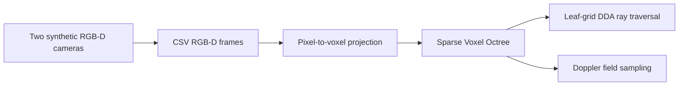

# Voxel4D

> A C++17 research proof of concept for multi-view RGB-D fusion into a Sparse Voxel Octree (SVO), leaf-grid DDA traversal, and Doppler-field sampling.

**Voxel4D is an early research prototype, not a production-ready reconstruction engine.** Its purpose is to provide a small, reproducible code base for experimenting with the lower-level pieces of a future 4D spatial-capture pipeline. The current implementation uses deterministic synthetic RGB-D inputs rather than physical cameras.

| Project property | Current value |
|---|---|
| Primary language | English |
| License | MIT; see [LICENSE](LICENSE) |
| Minimum language standard | C++17 |
| Build system | CMake 3.16 or newer |
| Runtime inputs | Self-generated synthetic RGB-D CSV frames |
| Status | Research PoC / pre-1.0 |

## What the PoC demonstrates

The executable exercises a coherent baseline pipeline. It generates two virtual pinhole-camera views of a moving sphere, serializes them as RGB-D samples, projects them into a bounded SVO, tests a ray against occupied leaf voxels with DDA, and samples a classical acoustic Doppler field around a moving source.

| Component | Included in v0.1.0 | Important limit |
|---|---|---|
| Sparse Voxel Octree | Yes | The PoC allocates sibling nodes when refining an occupied path; it is not a memory-optimized production SVO. |
| Pixel-to-voxel fusion | Yes | Inputs are synthetic RGB-D; calibration, uncertainty, and sensor timing are not yet modeled. |
| DDA voxel traversal | Yes | Traversal runs at the finest leaf resolution and is CPU-only. |
| Acoustic Doppler sampling | Yes | It does not simulate acoustic occlusion, reflections, diffraction, or reverberation. |
| Optical Doppler helper | Yes | It is a numerical helper, not an optical renderer. |
| Visual odometry, LiDAR, radar, thermal sensors, spherical harmonics, AI, GPU/NPU acceleration | No | These are planned research directions, not implemented features. |

## Quick start

### Dependencies

You need a C++17 compiler, CMake 3.16 or newer, and [GLM](https://github.com/g-truc/glm). GLM is header-only. The CMake configuration first searches for a `glm::glm` package and then falls back to a system include directory.

| Platform | Example dependency installation |
|---|---|
| Ubuntu / Debian | `sudo apt-get install build-essential cmake libglm-dev` |
| Fedora | `sudo dnf install gcc-c++ cmake glm-devel` |
| macOS with Homebrew | `brew install cmake glm` |
| Windows with vcpkg | `vcpkg install glm` followed by CMake with the vcpkg toolchain file |

### Build and test

```bash
git clone https://github.com/gusinistro/voxel4d.git
cd voxel4d

cmake -S . -B build -DVOXEL4D_WARNINGS_AS_ERRORS=ON -DBUILD_TESTING=ON
cmake --build build --parallel
ctest --test-dir build --output-on-failure
```

### Run the demonstration

```bash
./build/voxel4d_poc
```

The executable writes deterministic RGB-D CSV frames under `build/data/` when run from the build directory. A successful run reports the number of fused samples, SVO nodes, a DDA hit, and Doppler-field samples.

### Sanitizer run on GCC or Clang

```bash
cmake -S . -B build-sanitized \
  -DVOXEL4D_WARNINGS_AS_ERRORS=ON \
  -DVOXEL4D_ENABLE_SANITIZERS=ON \
  -DBUILD_TESTING=ON
cmake --build build-sanitized --parallel
ASAN_OPTIONS=detect_leaks=1 ctest --test-dir build-sanitized --output-on-failure
```

## Repository layout

```text
.
├── .github/                 # CI, issue forms, pull-request template, and automation
├── docs/                    # Architecture, release material, and archived Portuguese notes
├── include/                 # Public PoC interfaces
├── src/                     # C++17 implementation
├── tests/                   # Test assets and future unit-test home
├── CMakeLists.txt           # Reproducible build configuration
├── CONTRIBUTING.md          # Contributor workflow
├── CODE_OF_CONDUCT.md       # Community expectations
├── SECURITY.md              # Vulnerability-reporting policy
└── LICENSE                  # MIT license
```

## Architecture in brief



Read [the architecture note](docs/architecture.md) for data contracts, coordinate conventions, and known limitations. The original Portuguese research notes are retained under `docs/` for historical context; they are **concept notes**, not a statement of implemented capability.

## Contributing

We welcome issues, code, documentation, tests, benchmarks, reproducible datasets, and design discussions. Please read [CONTRIBUTING.md](CONTRIBUTING.md), follow the [Code of Conduct](CODE_OF_CONDUCT.md), and report security issues privately as described in [SECURITY.md](SECURITY.md).

## Governance and support

Voxel4D follows the lightweight maintainer model defined in [GOVERNANCE.md](GOVERNANCE.md). Public technical questions belong in GitHub Discussions or Issues once the repository is published. This repository does not provide commercial support or make claims of suitability for safety-critical deployment.

## Citation

If you use this repository in academic or technical work, cite the version you used. A machine-readable citation record is available in [CITATION.cff](CITATION.cff).

## License

The project source code is released under the [MIT License](LICENSE). See [NOTICE](NOTICE) for dependency attribution.
