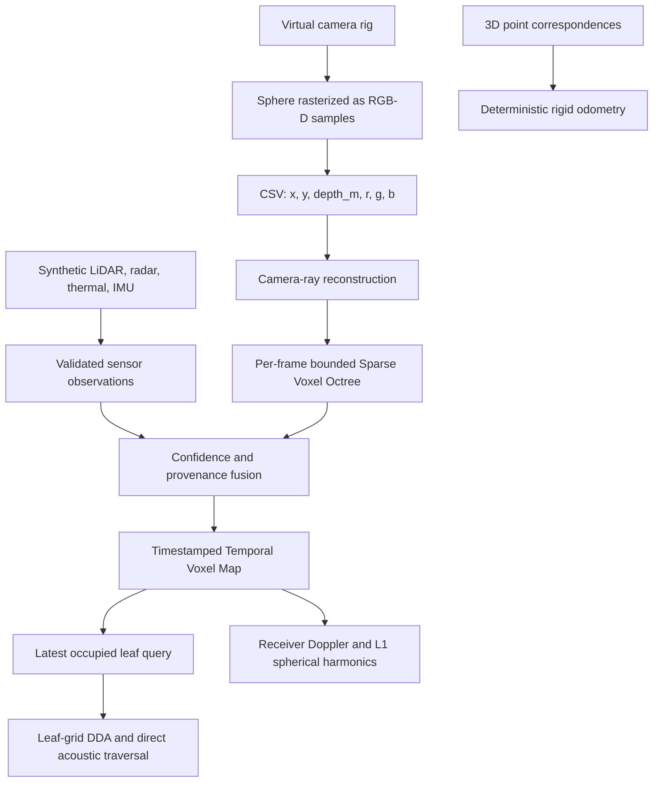

# Voxel4D Architecture

## Purpose

Voxel4D is a compact C++17 proof of concept for experimenting with a deterministic path from synthetic multi-observation inputs to time-indexed voxel state. It is designed to make state, units, provenance, and limitations inspectable rather than to claim full real-time 4D reconstruction.

> **Scope boundary:** the repository processes deterministic synthetic RGB-D and simulated multissensor observations, bounded timestamped SVO snapshots, supplied synthetic 3D correspondences, direct acoustic blocking, and first-order spherical harmonics. It does not implement physical device capture, calibration estimation, image feature matching, RANSAC, sensor clock synchronization, real LiDAR/radar/thermal/IMU drivers, neural inference, Gaussian splatting, free-viewpoint rendering, actual GPU/NPU/APU backends, or full physical sound transport.

## Data flow

The pipeline intentionally writes and reads RGB-D CSV frames before fusion. The synthetic sensor adapter is a separate, validated input boundary for RGB-D, LiDAR, radar, thermal, and IMU envelopes. Both are replayable sources for testing contracts before real-device adapters are introduced.

## Coordinate and unit conventions

| Item | Convention |
|---|---|
| Coordinate system | Right-handed world coordinates, using GLM vectors. |
| World length | Metres. |
| Velocity | Metres per second. |
| Timestamp | Signed integer nanoseconds in a monotonic timeline. |
| Sensor confidence | Dimensionless value in the closed interval [0, 1]. |
| Acoustic frequency | Hertz. |
| Optical wavelength | Metres. |
| Camera projection | Pinhole camera with vertical field of view in degrees. |
| Pixel origin | Top-left; normalized device coordinate `y` increases upward. |
| Depth | Metric distance along the normalized camera ray, not camera-space Z. |
| Occupancy | A leaf is occupied only if `VoxelAttribute::density > 0`. |

## Core modules

| Module | Responsibility | Contract |
|---|---|---|
| `SyntheticDataGenerator` | Creates deterministic two-camera RGB-D observations of a moving sphere. | Throws for invalid dimensions, frame counts, malformed CSV, or unavailable output paths. |
| `Voxelizer` | Converts RGB-D pixels into world-space samples. | Validates camera intrinsics, image bounds, and depth clipping range before insertion. |
| `SparseVoxelOctree` | Stores spatial voxel attributes. | Rejects out-of-bounds insertions; attributes include occupancy, confidence, modality bitmask, and last-observed timestamp. |
| `TemporalVoxelMap` | Retains discrete SVO snapshots in strictly increasing timestamp order. | Rejects null, duplicate, and out-of-order snapshots and evicts only the oldest snapshot when its fixed count is exceeded. |
| `SensorPose` / `SensorPoseTimeline` | Represents validated rigid transforms and bounded ordered pose histories. | Preserves supplied poses; it does not estimate calibration, motion interpolation, or clock alignment. |
| `VisualOdometryEstimator` | Fits rigid motion to supplied 3D correspondence pairs. | It has no image feature extraction, matching, RANSAC, loop closure, or real-camera integration. |
| `SensorObservation` / `SyntheticSensorAdapter` | Provides validated synthetic RGB-D, LiDAR, radar, thermal, and IMU envelopes. | They are deterministic adapters, not hardware drivers. |
| `MultiSensorFuser` | Fuses spatial samples with confidence, modality bitmask, and timestamp provenance. | It is not TSDF, probabilistic occupancy, uncertainty filtering, or SLAM. |
| `VoxelRaytracer` / `AcousticRaytracer` | Performs leaf-grid DDA and direct-path acoustic blocking. | Acoustic tracing excludes reflections, diffraction, reverberation, and frequency-dependent attenuation. |
| `SphericalHarmonicsL1` | Accumulates and evaluates real first-order directional radiance. | It does not load environment maps, trace light transport, or shade a renderer. |
| `ExecutionRuntime` | Runs independent index ranges on CPU serial or CPU parallel execution. | GPU, NPU, and APU requests report a CPU fallback until specific backends are implemented. |
| `DopplerSimulator` | Computes classical acoustic ratios and a longitudinal relativistic optical helper. | Assumes a stationary acoustic medium; field samples are receivers, not a full transport simulation. |

## Spatial storage and traversal

The Octree is **sparse with respect to occupied paths**, but intentionally simple: refining an occupied node allocates eight children. This keeps the PoC inspectable but is not a compact pointerless or DAG-based SVO. Node pooling, Morton ordering, bitmasks for child topology, confidence aging, temporal compression, and GPU-resident storage remain future work.

The DDA implementation traverses the regular grid implied by the finest Octree leaf size and queries the SVO for occupancy. This is deterministic and suitable for validation, but it does not hierarchically skip empty regions. Production traversal should combine compact node storage, hierarchical skipping, packet/coherent rays, and dedicated accelerator kernels.

## Physics boundary

| Included | Not included |
|---|---|
| Classical acoustic Doppler at sampled receiver positions | Reflections, diffraction, reverberation, or impulse responses |
| Longitudinal relativistic optical ratio | Refraction, scattering, polarization, or spectral rendering |
| Direct occupied-voxel acoustic blocking and geometric travel time | Frequency-dependent transmission loss and wave-equation simulation |
| First-order real spherical-harmonic radiance | Higher-order lighting, environment maps, or global illumination |
| Explicit SI-style units in APIs | A complete 4D physics solver |

## Hardware execution boundary

The portable CPU serial path is the correctness baseline for older hardware. CPU parallel execution is available only for independent index-range callbacks whose caller can safely execute concurrently. GPU, NPU, and APU requests currently select a visible CPU-serial fallback, so the code never silently claims acceleration that is not present.

## Evolution path

The current baseline includes timestamped spatial snapshots, supplied-pose histories, deterministic rigid alignment, simulated multissensor envelopes, attribute provenance fusion, direct acoustic blocking, L1 spherical harmonics, and a portable execution facade. The next steps must preserve deterministic validation while adding calibrated device ingestion, image correspondence and outlier handling, clock synchronization, uncertainty-aware fusion, compact voxel storage, actual accelerator kernels, and only then learned acceleration or post-processing.
