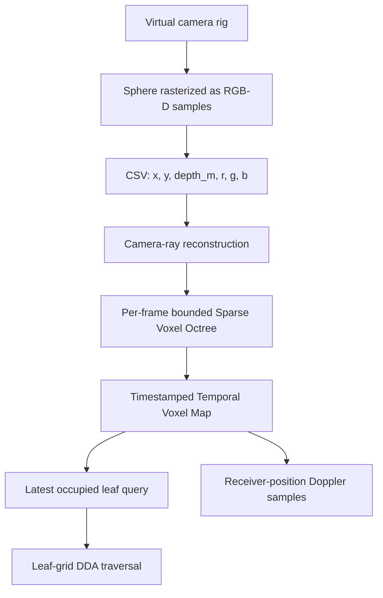

# Voxel4D Architecture Note

## Purpose

Voxel4D is a compact C++17 proof of concept for experimenting with a deterministic path from multiple RGB-D observations to a voxel representation. It is designed to make its state, units, and limitations visible rather than to claim full real-time 4D reconstruction.

> **Scope boundary:** the repository currently processes only its own synthetic RGB-D frames and bounded timestamped SVO snapshots. It does not implement camera capture, calibration, visual odometry, sensor-time synchronization, LiDAR/radar/thermal fusion, neural inference, spherical harmonics, Gaussian splatting, free-viewpoint rendering, GPU acceleration, or physical sound transport.

## Data flow

The pipeline intentionally writes and reads the CSV frames before fusion. This exercises a simple serialized input boundary that can later be replaced by calibrated camera, LiDAR, or other sensor adapters.

## Coordinate and unit conventions

| Item | Convention |
|---|---|
| Coordinate system | Right-handed world coordinates, using GLM vectors. |
| World length | Metres. |
| Velocity | Metres per second. |
| Acoustic frequency | Hertz. |
| Optical wavelength | Metres. |
| Camera projection | Pinhole camera with vertical field of view in degrees. |
| Pixel origin | Top-left; normalized device coordinate `y` increases upward. |
| Depth | Metric distance along the normalized camera ray, not camera-space Z. |
| Occupancy | A leaf is occupied only if `VoxelAttribute::density > 0`. |

## Core modules

| Module | Responsibility | Contract |
|---|---|---|
| `SyntheticDataGenerator` | Creates deterministic two-camera RGB-D observations of a moving sphere. | Throws for invalid dimensions, frame counts, malformed CSV, or unavailable output paths. |
| `Voxelizer` | Converts an RGB-D pixel into a world-space point along the corresponding camera ray. | Validates camera intrinsics, image bounds, and depth clipping range before insertion. |
| `SparseVoxelOctree` | Stores `VoxelAttribute` values at a configurable maximum depth. | Rejects out-of-bounds insertions and exposes empty leaves with density zero. |
| `TemporalVoxelMap` | Retains discrete SVO snapshots in strictly increasing timestamp order. | Uses signed nanosecond timestamps, rejects null, duplicate, and out-of-order snapshots, and evicts only the oldest snapshot when its fixed count is exceeded. It is not thread-safe. |
| `VoxelRaytracer` | Traverses cells at the finest leaf resolution using a 3D DDA. | Requires a non-zero ray direction and returns the first occupied cell, if any. |
| `DopplerSimulator` | Computes classical acoustic ratios and a longitudinal relativistic optical helper. | Assumes a stationary acoustic medium; sound-field samples are receivers, not a transport simulation. |

## SVO implementation detail

The data structure is **sparse with respect to occupied paths**, but it is deliberately simple: refining an occupied node allocates eight children. This makes the code easy to inspect but is not the compact pointerless or DAG-based SVO design commonly used in production renderers. Memory compaction, node pooling, Morton ordering, bitmasks, confidence-based temporal aging, and GPU-resident storage remain future work.

## DDA implementation detail

The octree keeps sparse attributes, while the DDA uses the smallest leaf-cell size as a regular traversal grid. At each visited cell, the tracer queries the SVO and accepts the first leaf whose density is positive. This is deterministic and suitable for the PoC, but it does not yet skip empty octree regions hierarchically. A production implementation should combine hierarchical node traversal with GPU kernels, packet/coherent rays, and sensor-confidence weighting.

## Physics boundary

The acoustic helper applies the classical Doppler relationship for a stationary medium. The optical helper computes the longitudinal special-relativistic frequency ratio for a moving source and stationary observer. Neither helper integrates wave propagation through the voxel environment.

| Included | Not included |
|---|---|
| Frequency shift at sampled receiver positions | Acoustic occlusion and transmission loss |
| Moving source and observer velocities for sound | Reflections, diffraction, reverberation, or impulse responses |
| Moving source for optical ratio | Refraction, scattering, polarization, or spectral rendering |
| Explicit SI-style units in API names | A complete 4D physics solver |

## Evolution path

The first temporal increment now retains bounded, timestamped spatial snapshots. The recommended next steps remain to preserve deterministic validation at every stage: calibrated camera ingestion, temporal pose estimation, sensor-time synchronization, uncertainty-aware fusion, object/scene layers, GPU traversal, and only then learned acceleration or post-processing. Each added layer should retain replayable data and numerical tests so that it can be compared against the baseline PoC.
